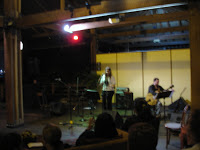

La noche de ayer resultó más relajada de lo normal, comenzando con que debido a las votaciones de hoy había ley seca y todo el mundo estaba en casa o regresaba temprano, por mi parte recibí una invitación a una velada cuyo objetivo era hacer un recorrido por la historia del jazz.

El evento fue organizado dentro del parque histórico de Guayaquil, lo que le da un componente extra en cuanto a lo alternativo del evento pues nos encontramos con personajes (actores) que representaban a la gente del Guayaquil de los años 20 y nos daban la bienvenida al viaje por el tiempo.

El evento tenía 2 partes, la primera era la historia del jazz desde los años 20 a los 40 presentado por el grupo "Francisco Echeverría y Standard Trip". Me parece una buena idea la de tratar de mover a los guayaquileños para que escuchen más jazz, pero creo que el Standard Trip se queda un poco corto por momentos, le hace falta más fuerza, se mantienen como grupo instrumental sin tener mucho brillo que resalte y ayude a enganchar a la gente, pocos matices y un sonido un tanto apagado. (Obviamente es opinión personal). En resumen, no digo que lo hagan mal, pero podrían hacerlo muchísimo mejor.

La sorpresa de la noche vino luego, aunque era extraño para mi, la gente se comenzó a ir y finalmente quedamos un grupo pequeño, se convirtió de un recital a una presentación casi familiar. El siguiente espectáculo era presentado por un dueto para mi desconocido llamado "Flora y Fauno", compuesto por Rochi Vernaza y Fernando Arosemena que a su vez eran acompañados por coreografías del grupo Danzas Jazz. Siendo apenas 2 personas, con 4 "instrumentos" (La voz y el Saxo Alto por Rochi, la guitarra y las secuencias por Fernando) dieron un muy buen espectáculo. Hubiera sido muchísimo más rico si tuvieran el acompañamiendo del resto del grupo para la batería y un teclado al menos, pero las secuencias no molestaron en absoluto.

Personalmente me impresionó la voz de la cantante que de hecho alternaba segmentos que interpretaba con el saxo y casi de inmediato podía comenzar a cantar con mucha fuerza. Inclusive presentó una canción de su propia autoría, por lo cual espero que consiga el apoyo para poder promocionarla y que siga haciéndolo.

Para no hablar mucho, mejor mostrar algo, grabé un pequeño fragmento de la canción de cierre "My Way" de Frank Sinatra, me hubiera gustado grabar muchas más, pero mi cámara estaba casi a tope, olvidé vaciarla antes de salir :S

Parte del repertorio que interpretaron fue:

- Garota de Ipanema - Antonio Carlos Jobim
- Fly me to the moon - Frank Sinatra
- Chega de Saudade - Antonio Carlos Jobim
- The Days of Wine and Roses - Frank Sinatra
- Summertime - Ella Fitzgerald
- Desafinado - Gal Costa
- Unforgettable - Nat King Cole
- Essenzialmente - Patrizia Laquidara
- Stop Fooling yourself - Rochi Vernaza
- Georgia on my Mind - Ray Charles

El hecho de estar en el parque histórico le agregó un detalle adicional, estábamos junto al río, con las luces de la ciudad del otro lado, un Guayaquil antigüo que nos acompañaba con sus personajes, junto con la brisa y la paz. De acuerdo a lo que dijeron al final del show, para el próximo 18 de octubre hay un nuevo evento, así que si se animan apúntenlo en sus agendas.

Actualización:

Una vez más, six degrees of separation, buscando información sobre ella en Internet el amigo "cara de libro" (Facebook) me mostró que no sólo tenemos uno, sino 6 amigos en común, mal mal, que mis amigos conozcan a una cantante como ella y no la promocionen :P Aunque eso explicaría porqué extrañamente se me hacía familiar un poco el rostro, quizá alguna vez la vi en una reunión.

Encontré otro video justamente con la canción de su autoría: