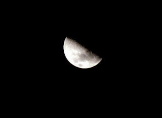
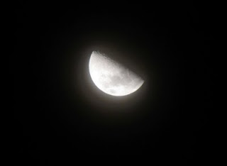

No queda más que decir, cóooooomo me gusta mi cámara... ja ja ja... es un cacharro que no llega a ser profesional, pero con un poco de astucia se puede lograr resultados como este:

Fijarse bien en los cráteres :P

PD: Esto lo tomé desde la ventana de mi apartamento con las luces apagadas
