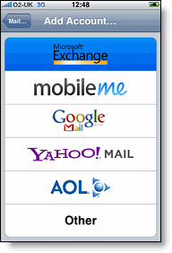

Un post cortito, algo muy interesante que tiene el iPhone y recientemente está terminando de montar RIM para los Blackberry es el soporte para recibir notificaciones "push", que principalmente funcionan con servidores de correo Exchange, aunque hay otros que dan el servicio como Google.

Ahora, en castellano: ¿Qué quiere decir esto? o ¿Qué carajos es?

Las notificaciones push hacen que en lugar de tener que conectarte al servidor a preguntarle ¿hay correos nuevos? o ¿Hay algún contacto nuevo o tengo nuevas citas? Sea al revés, por ejemplo me llega un correo de un nuevo proveedor diciendo que va a ir a visitarme a la oficina el día martes, para no olvidarme lo anoto en el [Google Calendar](https://calendar.google.com/) y grabo su correo con el teléfono y dirección en la libreta de contactos de [GMail](https://gmail.com/), y casi de inmediato, reviso mi teléfono y listo, ahí está, el nombre del proveedor con sus datos y la cita en mi calendario dentro del teléfono, ¡genial!

Igual con los correos, si llega un correo nuevo el servidor le notifica al dispositivo que hay nueva información y que debe descargarla. Normalmente se utiliza mucho en ambientes corporativos, pero en el caso de los servicios de Google es fantástico para mantener toda la info conectada, ya ni siquiera necesitas sacar respaldo de tus contactos, si agregas un nuevo contacto en tu celular, automáticamente se sube al GMail (si tienes conexión a internet en el móvil).

En fin, si alguien quiere ver cómo se configura los servicios con Google, acá las instrucciones:
[http://www.google.com/support/mobile/bin/answer.py?answer=138740&topic=14252](https://www.google.com/support/mobile/bin/answer.py?answer=138740&topic=14252)
