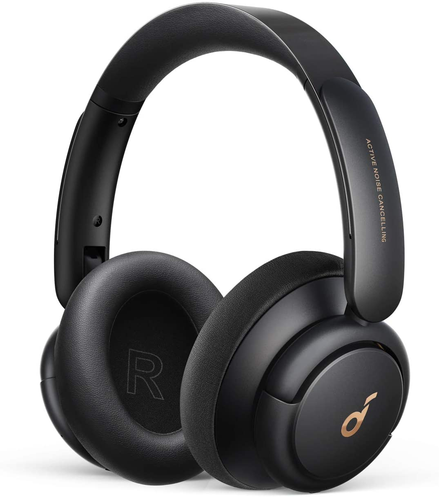

### Audífonos con cancelación de ruido

No importa si estás en un hotel, una casa o una cafetería, siempre habrá ruido de fondo que pueda afectar tanto tus reuniones como simplemente poder estar concentrado en casa, una de las mejores inversiones será un par de audífonos con cancelación de ruido, actualmente en el mercado hay una lista muy larga y de diferentes precios, desde los que pueden costar cerca de mil dólares, hasta los por debajo de los $100, en mi experiencia, puedes conseguir muy buenos audífonos sin romper tu alcancía, uno de mis recomendados al momento son los Anker Life Q30, que al escribir este artículo tienen un precio de $80 USD  en [Amazon](https://www.amazon.com/-/es/gp/product/B08HMWZBXC) y tienen conexión multipunto, eso quiere decir que podrás utilizarlos inclusive con varios dispositivos al mismo tiempo, como por ejemplo responder a una llamada de tu celular mientras escuchas el audio de tu computadora a la vez.  Otra buena opción dentro de ese rango son los [Noche de Carlos Santana](https://www.amazon.com/-/es/Auriculares-cancelaci%C3%B3n-auriculares-almohadillas-reproducci%C3%B3n/dp/B083ZQ8FHY/), que igualmente no pasan de los $80.

Lo principal a tomar en cuenta es que sean cómodos (puedes necesitar pasar muchas horas con estos puestos) y que la cancelación de ruido sea activa.

### Cancelación de ruido en el micrófono

Los audífonos con ANC (Active Noise Cancellation) eliminan el ruido para nosotros, no escuchamos la mayor parte de los ruidos alrededor, pero nuestro micrófono sí registra lo que pasa a nuestro alrededor y eso puede ser escuchado por las personas con las que estemos reunidos de forma virtual, una buena herramienta para librarnos de eso hay dos opciones, la primera es utilizar un micrófono externo (cardioide de preferencia) con reducción de ruido, por más que nuestro computador tenga un micrófono incorporado, es muy difícil que pueda capturar de manera adecuada el sonido, especialmente si hay más ruidos alrededor.  Mi recomendación para esto son los [Fifine](https://www.amazon.com/Microphone-Condenser-Recording-Streaming-669B/dp/B06XCKGLTP) que por $35 nos permiten tener un sonido claro y sin agregar mucho peso en nuestra mochila.

Si prefieres no agregar más hardware a tu kit, una opción de software es [Krisp](https://krisp.ai/), una aplicación que permite eliminar el ruido del ambiente mientras estamos hablando, el único problema es que funciona en base a subscripción, así que tendrás que estar dispuesto a gastar unos $60 al año para usarlo, aunque tienen una versión gratuita que permite usarlo por 120 minutos por semana, pero para un trabajador remoto eso puede quedarse corto con mucha facilidad.