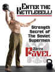
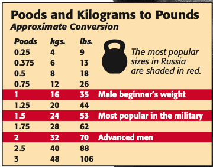

Durante todo el tiempo que hemos estado en confinamiento muchos comenzaron a entrenar en casa ante la imposibilidad de ir a un gimnasio, por una parte para mantenerse en forma, por otra parte para mantener algo de sanidad mental .  Sin embargo contar con un equipo completo como para entrenar sería muy costoso, o inclusive difícil tener espacio para muchas cosas, la solución para algunos ha sido:

> Enter The Kettlebell.

Utilizo esa frase en inglés porque literalmente es el nombre del [libro](https://www.amazon.com/dp/B004XIZK5K/) + videos que me animaron a probar esta forma de entrenamiento, aunque yo ya tenía buen tiempo entrenando en casa quería cambiar por algo distinto, algunas veces había escuchado hablar al respecto y fue buen momento para probarlo, el autor del libro es [Pavel Tsatsouline](https://en.wikipedia.org/wiki/Pavel_Tsatsouline), un ex-entrenador de los Spetsnaz (fuerzas especiales rusas) a quien se lo conoce como el que popularizó el uso moderno en el lado occidental de los Kettlebells (KB en adelante).

La idea es obtener un resultado efectivo con casi nada de equipo y en poco espacio.

Antes de avanzar quiero resaltar que no soy un experto en entrenamiento ni mucho menos, sí soy bastante autodidacta, leo todo lo que puedo y me gusta informarme, pero como hobbie y siempre será mejor consultar con un experto (al final del artículo les dejaré a dos en los que confío mucho).

## ¿Qué es un Kettlebell o Pesa Rusa?

El KB no es más que "una bala de cañón" con una agarradera, figurativamente hablando, es bastante sencilla, pero permite hacer algunas cosas interesantes, el punto fuerte es que permite combinar entrenamiento de resistencia (fuerza) con actividad cardiovascular, y por los movimientos que se realizan (siguiendo las guías) nos obliga a jugar mucho con el balance del cuerpo y controlar los movimientos.

Fácilmente se puede tener un entrenamiento completo apenas con 1 KB y en 1 metro cuadrado sin más equipo, hasta sin zapatos (de hecho hasta lo recomendaría para darte cuenta si los pies están haciendo contacto de forma correcta).

## ¿Bueno, pero funciona o no?

Leyendo al respecto hay quienes lo ponen como si con esto se pueden alcanzar resultados geniales, etc... Realmente y en mi experiencia, cualquier tipo de ejercicio realizado de forma constante, más una buena alimentación (no dieta, solo buena alimentación) va a funcionar, lo que puedo poner como un plus atractivo es que con los KB puedes lograr una buena sesión en apenas 15 o 20 minutos al día y que sí logra tener esa combinación entre pesas y cardio de una forma entretenida.

Un factor a favor (y por cuál lo utilizan para atletas en recuperación o mayores) es que se puede usar para recuperar y desarrollar explosividad sin necesidad de lastimar rodillas o generar un alto impacto que nos pueda lastimar.

Una consideración que va por igual para hombres y mujeres, si el objetivo que tienen es perder peso, por lo general piensan hay que hacer mucho cardio por horas de horas, si bien puede ayudar un poco, realmente los resultados de eso no se comparan con lo que pueden lograr incluyendo ejercicios de resistencia (pesas) porque las pesas generan músculos y el músculo ayuda a quemar grasa mucho más rápido que esas tremendas sesiones donde lo que más logran es deshidratarse, además de desarrollar fuerza y resistencia.

Una nota especial para las mujeres es que no deben tenerle miedo a las pesas, no van a convertirse en moles llenas de músculos por levantar pesas, lo que lograrán es tener más definición y fuerza.  Y de hecho la aclaración inversa para los hombres, las KB no los van a convertir en moles musculosas, van a estar en forma, pueden lograr buena definición, con mayor agilidad y si llegan a manejar un buen peso sí tendrán músculos relativamente grandes, pero nada de hipertrofia nivel "Schwarzenegger", lo cual personalmente prefiero, porque me gusta más la idea de no ser muy lento y pesado.

## ¿Con qué peso comenzar?

La primera pregunta que va a aparecer es: ¿Qué me compro? ¿Con cuánto peso debo comenzar? 

El punto de partida es saber cuál es tu nivel de actividad física actual.  Para esto no voy a "inventarme  el agua tibia" y voy a pasar directamente la referencia del libro Enter the Kettlebell, para comenzar:

Para hombres si no han estado acostumbrados a hacer ejercicios y son principiantes, se recomienda que no sea menos de 8kg, si pueden realizar la inversión les diría que compren de una vez 8 y 16kg.   La progresión pasará de forma natural y bastante rápido, ya cuando logren llegar a un buen nivel el siguiente brinco son los 24kg.  En cambio si ya comienzas desde una buena base, estás acostumbrado a entrenar frecuentemente, los mínimos serían 16kg y 24kg. 

Para las mujeres sin entrenamiento previo recomiendan arrancar en 6kg, para luego pasar a 8 y 12kg, pero es una referencia y siempre podrá evaluarlo mejor un profesional que pueda indicar cuál es tu punto de partida.

## ¿Tengo mis KB y ahora?

Lo que resulta muy interesante de usar KB es que no hay que aprenderse un montón de ejercicios (aunque se puede, hay montones de opciones si te llegas a aburrir), pero muchos autores y entrenadores hablan de 4 a 6 movimientos con los que si quisieras, te podrías pasar el resto de tu vida (aunque siempre es bueno variar).  Los movimientos son, los básicos:

* [Swings](https://www.youtube.com/watch?v=GYHbu2LRqD0)
* [Cleans](https://www.youtube.com/watch?v=ZuTKcP6vtfI)
* [Presses](https://www.youtube.com/watch?v=48qvCvJJr8Y)
* [Squats](https://www.youtube.com/watch?v=3wioCm5Qe-U)

Y los más avanzados:

* [Snatchs](https://www.youtube.com/watch?v=xQqCyl-2ixQ)
* [Turquish Get Ups](https://www.youtube.com/watch?v=2YollP91Wro)

Cada uno tiene un link con una demostración del movimiento, recomendaría fijarse mucho en cómo se realiza cada uno, porque definen cuál es el centro de cada movimiento, el movimiento fundamental es el Swing, el cual en un gran porcentaje movimiento de cadera más soporte de espalda, brazos, glúteos y abdomen, si lo haces mal al revés lo que van a sufrir son los brazos y la espalda (créanme lo sentí al querer hacerlo a lo loco la 1era vez).  Y en cambio bien realizado el movimiento se siente fluido. 

Una de las cosas que dice Pavel en su libro y coincido al 100% es que es preferible dedicar un tiempo a trabajar en el balance y en la forma, inclusive sin peso si es necesario para evitar lesionarse y para que realmente funcionen.

Entrenamientos basados en KB hay montones por internet, especialmente en Youtube, lo que destacaría es primero aprender a hacer los movimientos base y luego ir haciendo las progresiones poco a poco.   Les dejo uno de los primeros con los que probé y que me dejó claro que en 15 minutos se puede lograr bastante: 

[15 Min FULL BODY KETTLEBELL WORKOUT at Home | Caroline Girvan](https://www.youtube.com/watch?v=VCcar3MA07w)

Como decía al inicio del post, lo mejor siempre será consultar con un profesional, en este caso los 2 que recomiendo por conocerlos y saber el nivel que tienen son:

* [Paola Lopez (Dra. Especialista en medicina del deporte)](https://www.instagram.com/paopao_lt/)
* [Paúl Flores (Nutrición Clínica y Preventiva)](https://www.instagram.com/paulfloresp/)